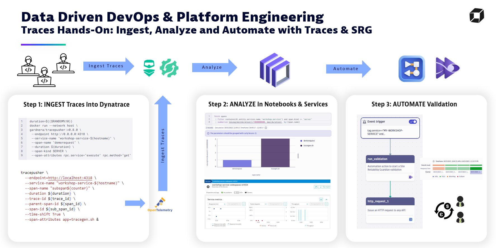
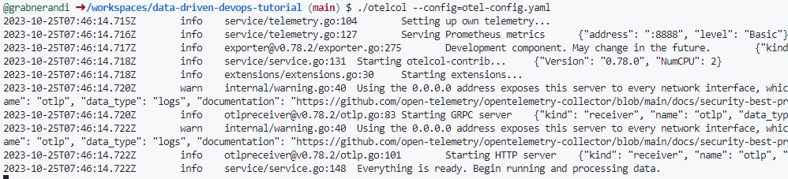

# Data Driven DevOps Done Right with Dynatrace
For the logs workshop please see [Hands-On Logs](README.md)

## Hands On for Tracing
This is a tutorial material for the workshop series on Data Driven DevOps & Platform Engineering with Dynatrace.

**Got feedback or questions?**: [devrel@dynatrace.com](mailto:devrel@dynatrace.com?subject=DataDrivenDevOps%20Traces%20HandsOn)

The goal of this workshop is to educate on
- INGEST observability data (logs, traces, metrics ..) using OpenTelemetry, Log API or Dynatrace OneAgent
- ANALYZE and COLLABORATE on data using Dynatrace Notebooke
- AUTOMATE based on that this data

[Click here to learn more about Dynatrace Log Management and Analytics capabilities](https://www.dynatrace.com/support/help/observe-and-explore/logs/log-management-and-analytics)



## Hands-On workshop steps WITHIN the Dynatrace Platform

We have this [Dynatrace Notebook](./notebooks/Data%20Driven%20DevOps%20Hands%20On%20for%20Logs_%20Ingest,%20Analyze,%20Automate%20(grabnerandi).json) that contains all step-by-step instructions that workshp attendees can do within the Dynatrace platform. 
You will either be given a link to this Notebook in the Workshop Environment or you can simply download the Notebook and Import it into your own Dynatrace Tenant!

For sending in data from outside the platform please follow the steps further down in this readme.

## Preparation for Hands-On steps outside of Dynatrace Platform

Some of our hands-on will require us to send in data from an external machine, e.g: your workstation, a virtual machine, a GitHub Codespace or GitPod.

### Step 1: Fork GitHub Repo
We suggest that you first FORK this repository into your own GitHub Account

### Step 2a: Clone Repo locally (when you run on your own machine)
If you decide to use your own laptop or virtual machine then clone this repository to your local drive and then execute .devcontainer/on-create.sh

### Step 2b: Launch Codespaces or GitPod
To make things easier we can just create a Codespace or use a service such as GitPod which will create a VM for you and will then execute the on-create.sh scripts automatically.
Later on we will need to uniquly identify our log entries. There please export your name (can be real or made up) in the USER env variable - like this:
```
MYNAME="Ruler of OpenTelemetry"
```

### Step 3: Configure OpenTelemetry Endpoints
The tutorial uses an OpenTelemetry collector which we need to configure with the correct Dynatrace OTLP Endpoint.
For this simply edit the otel-config.yaml file and specify the correct Dynatrace Tenant URL and also specify your OpenTelemetry Ingest Token.

You can either use your own Dynatrace Tenant and then create a token with the scopes: `events.ingest,logs.ingest,metrics.ingest,openTelemetryTrace.ingest`
OR you can use the data provided by your instructor in case you are doing this excercise as part of a Hands-on Dynatrace Workshop!


### Step 4: Launch the OpenTelemetry Collector

Simple launch the collector which was downloaded by the on-create.sh script like this:
```
./otelcol --config=otel-config.yaml
```



## Hands-On Tutorial: Sending Traces via OpenTelemetry

Typically your applications instrumented with OpenTelemetry would send trace information to your OpenTelemetry collector which then forwards it to e.g: Dynatrace.
There are also other tools in the CI/CD space (Jenkins, GitLab, GitHub ...) that provide OpenTelemetry plugins or extensions to create traces everytime a job or a pipeline is executed.

**DISCLAIMER: Tracepusher is just a tool for demo purposes**
In our hands-on we will use an open source helper tool that is called [Tracepusher from Adam Gardner](https://github.com/agardnerit/tracepusher). 

The docker container and the standalone binary from Tracepusher has already been downloaded. We can now execute the following command that will create traces for a particular service with additional span attributes

```
time_start=$SECONDS
sleep 1
time_end=$SECONDS
duration=$(( $time_end - $time_start ))
docker run --network host \
gardnera/tracepusher:v0.8.0 \
 --endpoint http://0.0.0.0:4318 \
 --service-name "workshop-service-$(hostname)" \
 --span-name "demorequest" \
 --duration ${duration} \
 --span-kind SERVER \
 --span-attributes rpc.service="execute" rpc.method="get"
```

There is also a script that generates a more complex trace with subspans as well as with a log that is connected with the trace.
To generate that execute this:
```
./tracegen.sh
```